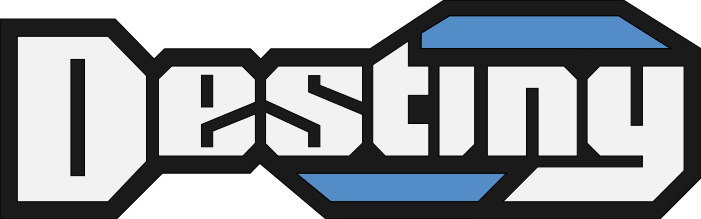

This is a WIP frontend replacement for destiny.gg.

## Requirements

- [npm](https://www.npmjs.com/)
- [mkcert](https://github.com/FiloSottile/mkcert)

## Instructions

1. Install requirements listed above
2. Clone this repository
3. Navigate to the root folder (where this file is located)
4. Install all project dependencies

```
npm install
```

5. Create and install a locally-trusted certificate

```
mkcert localhost
```

6. Generate a JWT secret (Note: You must use the same secret for the frontend and API)

```
openssl rand -base64 172 | tr -d '\n'
```

7. Create`.env.local` in the root folder and add the following with your completed info

```
NEXT_PUBLIC_API_URL="http://127.0.0.1:8000"
NEXT_PUBLIC_LOCAL_URL="http://localhost:3000"
NEXT_PUBLIC_JWT_SECRET=""
NEXTAUTH_URL="http://localhost:3000/api/auth"

NEXT_PUBLIC_DISCORD_ID=""
NEXT_PUBLIC_DISCORD_SECRET=""
```

8. Run your local development server

```
npm run dev
```

9. Access your development server at https://localhost:3000/
